# Build Stack

A complete, containerized Software Development Lifecycle (SDLC) stack for local development and CI/CD automation. This project provides an integrated environment with source control, CI/CD pipelines, artifact management, code quality analysis, and deployment—all running in Docker containers.

## 🏗️ Architecture

```mermaid
flowchart LR
    subgraph Source Control
        Gitea[("🗃️ Gitea<br/>(Git SCM)")]
    end

    subgraph CI/CD
        Jenkins[("⚙️ Jenkins<br/>(Pipelines)")]
        SonarQube[("🔍 SonarQube<br/>(Code Quality)")]
    end

    subgraph Artifact Management
        Nexus[("📦 Nexus<br/>(Artifacts)")]
    end

    subgraph Deployment
        Deployer[("🔄 Deployer<br/>(Sync Service)")]
        nginx[("🌐 nginx<br/>(Web Server)")]
    end

    subgraph Database
        PostgreSQL[("🐘 PostgreSQL")]
    end

    Gitea -->|"webhook/poll"| Jenkins
    Jenkins -->|"analyze"| SonarQube
    Jenkins -->|"publish artifacts"| Nexus
    Nexus -->|"poll & sync"| Deployer
    Deployer -->|"deploy to"| nginx
    SonarQube --> PostgreSQL
```



### Components

| Service | Port | Description |
|---------|------|-------------|
| **Gitea** | 3000 | Lightweight Git server with web UI, issue tracking, and pull requests |
| **Jenkins** | 8080 | CI/CD automation server with Job DSL and pipeline support |
| **Nexus** | 8081 | Artifact repository manager for storing build outputs |
| **SonarQube** | 9000 | Code quality and security analysis platform |
| **nginx** | 8088 | Web server for serving deployed applications |
| **Deployer** | - | Background service that syncs artifacts from Nexus to nginx |
| **PostgreSQL** | - | Database backend for SonarQube |

## 🚀 Quick Start

### Prerequisites

- Docker and Docker Compose
- At least 4GB RAM available for containers
- `vm.max_map_count >= 262144` (required for SonarQube)

```bash
# Set vm.max_map_count (required for SonarQube)
sudo sysctl -w vm.max_map_count=262144

# Make it permanent
echo "vm.max_map_count=262144" | sudo tee -a /etc/sysctl.conf
```

### 1. Clone and Configure

```bash
git clone <repository-url>
cd build-stack

# Create environment file with credentials
cat > .env << 'EOF'
GITEA_ADMIN_USER=admin
GITEA_ADMIN_EMAIL=admin@example.com
GITEA_ADMIN_PASS=your-secure-password

JENKINS_ADMIN_USER=admin
JENKINS_ADMIN_PASS=your-secure-password

SONAR_ADMIN_USER=admin
SONAR_ADMIN_PASS=admin
SONAR_NEW_PASS=your-new-sonar-password
EOF

chmod 600 .env
```

### 2. Start the Stack

```bash
docker-compose up -d
```

### 3. Access Services

- **Gitea**: http://localhost:3000
- **Jenkins**: http://localhost:8080
- **Nexus**: http://localhost:8081
- **SonarQube**: http://localhost:9000
- **nginx (deployed app)**: http://localhost:8088

## 📋 SDLC Workflow

The stack implements a complete CI/CD pipeline:

### 1. Source Control (Gitea)
- Create a repository (e.g., `hello-world`)
- Add source files (`index.html`, `Jenkinsfile`)
- Track work with issues

### 2. CI/CD Pipeline (Jenkins)
- **Seed Job**: Generates pipeline jobs from Git repositories
- **Pipeline**: Defined in `Jenkinsfile`, builds and publishes artifacts

Example `Jenkinsfile`:
```groovy
pipeline {
    agent any
    stages {
        stage('Publish to Nexus') {
            steps {
                sh '''
                    PASS=$(cat /nexus-data/admin.password)
                    curl -fsS -u admin:$PASS \
                        --upload-file index.html \
                        http://nexus:8081/repository/web/hello-world/index.html
                '''
            }
        }
    }
}
```

### 3. Artifact Storage (Nexus)
- Stores build artifacts in the `web` raw repository
- Artifacts accessible at: `http://nexus:8081/repository/web/<path>`

### 4. Deployment (Deployer → nginx)
- **Deployer** service polls Nexus for new artifacts
- Automatically syncs to `/deploy` volume
- **nginx** serves content from `/deploy`

### 5. Code Quality (SonarQube)
- Analyze code quality and security vulnerabilities
- Integrates with Jenkins pipelines via sonar-scanner

## 🧪 End-to-End Testing

The project includes a comprehensive Playwright E2E test suite that validates the entire SDLC flow.

### Running E2E Tests

```bash
# Run tests (headless)
bash scripts/run-sdlc-e2e.sh

# Run tests with browser visible
HEADED=1 bash scripts/run-sdlc-e2e.sh
```

### What the E2E Test Validates

1. ✅ Gitea installation and configuration
2. ✅ Repository creation with `index.html` and `Jenkinsfile`
3. ✅ Issue creation and tracking
4. ✅ Jenkins login and seed job execution
5. ✅ Pipeline build triggering and success
6. ✅ Artifact published to Nexus
7. ✅ Deployer syncs artifact to nginx
8. ✅ nginx serves the deployed content
9. ✅ Issue closure in Gitea

## 📁 Project Structure

```
build-stack/
├── docker-compose.yml      # Service definitions
├── .env                    # Environment variables (credentials)
├── jenkins/
│   ├── Dockerfile          # Custom Jenkins image
│   ├── plugins.txt         # Jenkins plugins to install
│   ├── jobs/
│   │   └── seed-job/       # Pre-configured seed job
│   └── init.groovy.d/      # Jenkins initialization scripts
│       ├── 01-security.groovy
│       └── 02-disable-script-security.groovy
├── deployer/
│   ├── Dockerfile          # Deployer service image
│   └── deployer.sh         # Nexus → nginx sync script
├── e2e/
│   ├── package.json        # Playwright dependencies
│   ├── playwright.config.ts
│   └── tests/
│       └── sdlc.spec.ts    # E2E test suite
├── scripts/
│   └── run-sdlc-e2e.sh     # E2E test runner
└── templates/              # Configuration templates
```

## ⚙️ Configuration

### Environment Variables

| Variable | Description | Default |
|----------|-------------|---------|
| `GITEA_ADMIN_USER` | Gitea admin username | `admin` |
| `GITEA_ADMIN_EMAIL` | Gitea admin email | `admin@example.com` |
| `GITEA_ADMIN_PASS` | Gitea admin password | - |
| `JENKINS_ADMIN_USER` | Jenkins admin username | `admin` |
| `JENKINS_ADMIN_PASS` | Jenkins admin password | `admin` |
| `SONAR_ADMIN_USER` | SonarQube admin username | `admin` |
| `SONAR_ADMIN_PASS` | SonarQube default password | `admin` |
| `SONAR_NEW_PASS` | SonarQube new password (after first login) | - |

### Jenkins Seed Job

The seed job is pre-configured to generate pipeline jobs from Gitea repositories:

- **GIT_URL**: `http://gitea:3000/<user>/<repo>.git`
- **GIT_BRANCH**: `main`

### Nexus Repository

The `web` raw repository is automatically created by the deployer service for storing web artifacts.

## 🔧 Customization

### Adding Jenkins Plugins

Edit `jenkins/plugins.txt`:
```
git
workflow-aggregator
job-dsl
# Add more plugins here
```

### Modifying the Deployer

Edit `deployer/deployer.sh` to customize:
- `NEXUS_REPO`: Repository name (default: `web`)
- `NEXUS_PATH`: Artifact path (default: `hello-world/index.html`)
- `POLL_SECONDS`: Sync interval (default: `5`)

### Custom nginx Configuration

Mount a custom nginx config:
```yaml
nginx:
  volumes:
    - ./nginx/nginx.conf:/etc/nginx/nginx.conf:ro
    - deploy:/usr/share/nginx/html:ro
```

## 🐛 Troubleshooting

### SonarQube Won't Start
```bash
# Check vm.max_map_count
cat /proc/sys/vm/max_map_count
# Should be >= 262144

# Fix temporarily
sudo sysctl -w vm.max_map_count=262144
```

### Jenkins Build Fails with "Script not approved"
The `02-disable-script-security.groovy` init script should disable this. If issues persist:
```bash
# Rebuild Jenkins image
docker-compose build jenkins
docker-compose up -d jenkins
```

### Nexus Returns 403 Forbidden
Ensure you're using Nexus 3.70.0 or earlier (EULA requirement added in 3.78.0+):
```yaml
nexus:
  image: sonatype/nexus3:3.70.0
```

### Deployer Not Syncing
Check deployer logs:
```bash
docker logs deployer
```

Verify the `web` repository exists in Nexus and artifacts are uploaded.

## 📊 Monitoring

### Container Status
```bash
docker-compose ps
```

### Service Logs
```bash
# All services
docker-compose logs -f

# Specific service
docker-compose logs -f jenkins
```

### Health Checks
```bash
# Gitea
curl http://localhost:3000/api/v1/version

# Jenkins
curl http://localhost:8080/api/json

# Nexus
curl http://localhost:8081/service/rest/v1/status

# SonarQube
curl http://localhost:9000/api/system/status
```

## 🧹 Cleanup

```bash
# Stop all services
docker-compose down

# Stop and remove volumes (WARNING: deletes all data)
docker-compose down -v

# Remove specific volume
docker volume rm build-stack_nexus-data
```

## 📜 License

MIT License - See [LICENSE](LICENSE) for details.

## 🤝 Contributing

1. Fork the repository
2. Create a feature branch
3. Make your changes
4. Run E2E tests: `bash scripts/run-sdlc-e2e.sh`
5. Submit a pull request

---

**Note**: This stack is intended for local development and testing. For production use, additional security hardening, SSL/TLS configuration, and proper secrets management are recommended.
